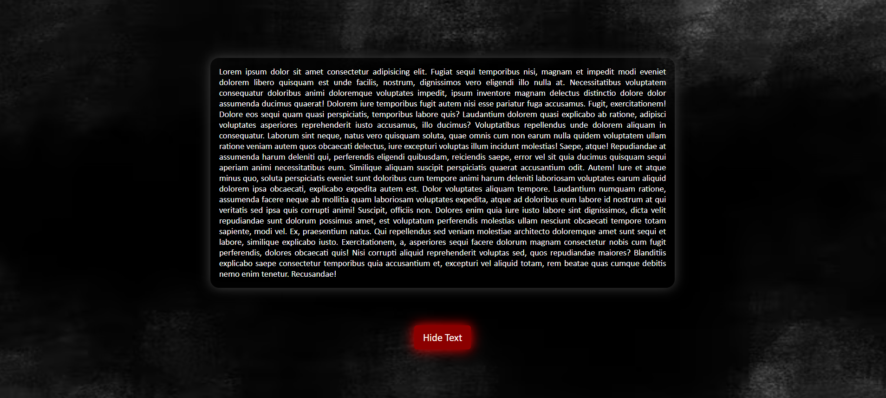

# Show / Hide Toggle Challenge from Claude
A minimalist, responsive Show/Hide component featuring a modern dark-themed UI.

## 🚀 Features
- Dynamic State Toggle: Smoothly switch between visible and hidden content states.
- Fully Responsive: Designed to adapt to various screen sizes while maintaining readability.
- Clean Implementation: Focused on semantic HTML and modular CSS.

## 🛠️ Built With
- HTML5: Structured for accessibility and clarity.
- CSS3: Utilizes custom animations, box-shadows for the "glow" effect, and flexbox layout.
- JavaScript (Vanilla): Light-weight logic for DOM manipulation and event handling.

## Link
[Live Demo]()

## Preview 
